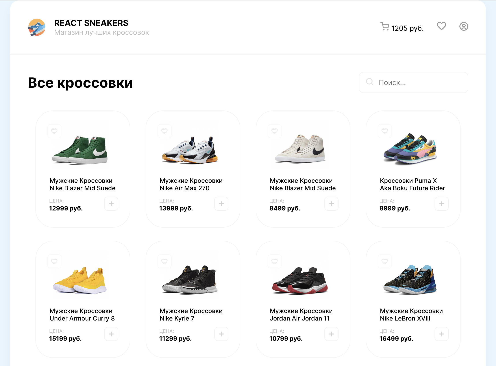
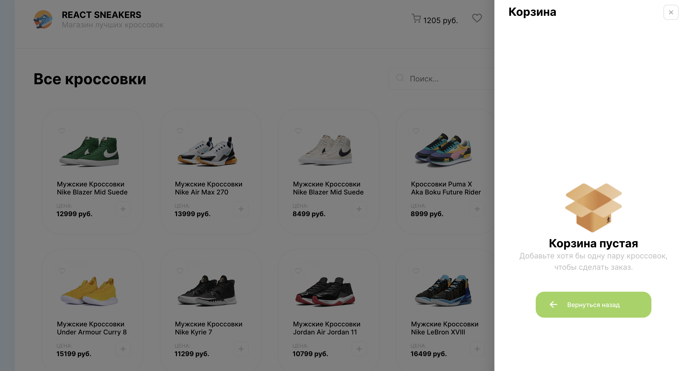

# React Sneakers Shop

## Preview

Главный экран интернет магазина

Корзина интернет магазина

## Functionality

1. Карточки на сайте выполнены как отдельные компоненты, названия, картинки, цены загружаются из MockAPI, число карточек на сайте зависит от состояние на backend
2. Пользователь может добавлять товары в корзину и они будут отображаться в ней, а также добавляться на backend и удаляться
3. Пользователь может добавлять товары в избранное. Страница избранных товаров реализована с помощью React Router

This project was bootstrapped with [Create React App](https://github.com/facebook/create-react-app).

## Available Scripts

In the project directory, you can run:

### `npm start`

Runs the app in the development mode.\
Open [http://localhost:3000](http://localhost:3000) to view it in your browser.

The page will reload when you make changes.\
You may also see any lint errors in the console.
